# Visão do Produto

## Lean Inception

Lean Inception é uma abordagem colaborativa para o planejamento e concepção de projetos ágeis introduzida por Paulo Caroli, um especialista em desenvolvimento ágil e práticas Lean. Ela combina os princípios do Lean Thinking e do desenvolvimento ágil para criar um ambiente de colaboração entre as partes interessadas, resultando em uma visão compartilhada e em um entendimento claro dos objetivos e requisitos do projeto.

A abordagem Lean Inception segue uma estrutura de atividades bem definida, conduzida em um workshop intensivo de alguns dias, inclui as seguintes atividades:

- Visão do produto
- É - NÃO É - FAZ - NÃO FAZ
- Esclarecimento do objetivo
- Personas
- Jornadas do Usuário
- Brainstorming de Funcionalidades
- Revisão Técnica, de Negócio e de UX
- Sequenciador
- MVP Canvas

### MVP

MVP é uma versão simplificada de um produto ou serviço que contém apenas as funcionalidades essenciais para atender às necessidades básicas dos usuários (Ries, 2011). 

É importante ressaltar que um MVP não é sinônimo de um produto de qualidade inferior ou que não irá evoluir. Pelo contrário, um MVP é desenvolvido de forma incremental, adicionando novos recursos mínimos aos produtos mínimos já validados. Conforme o feedback dos usuários é coletado e analisado, a equipe pode realizar melhorias e adicionar funcionalidades adicionais ao produto, aprimorando-o gradualmente (CAROLI, 2018). 

Essa abordagem incremental do MVP permite que o produto evolua de acordo com as necessidades e preferências reais dos usuários, garantindo um desenvolvimento direcionado e focado em agregar valor. Dessa forma, o MVP serve como uma base sólida para o crescimento e aprimoramento contínuo do produto ao longo do tempo.

### Etapas
#### Visão do produto
A visão do produto no Lean Inception é uma declaração compartilhada que define o propósito, os objetivos e os valores do produto. Ela fornece uma direção clara para a equipe e ajuda a garantir que todos tenham uma compreensão comum do que se espera alcançar com o produto.
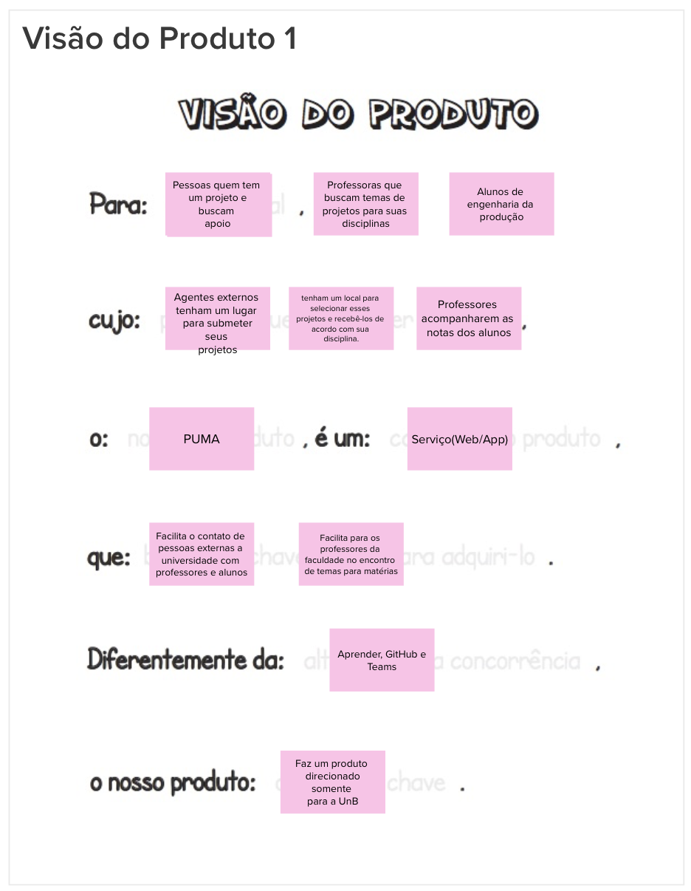

#### É - NÃO É - FAZ - NÃO FAZ
O "É - NÃO É - FAZ - NÃO FAZ" é uma etapa do Lean Inception para definir claramente as características e limites de um produto ou projeto. Ele consiste em categorias que descrevem o que o produto é, o que não é, o que faz e o que não faz.

##### É/Faz
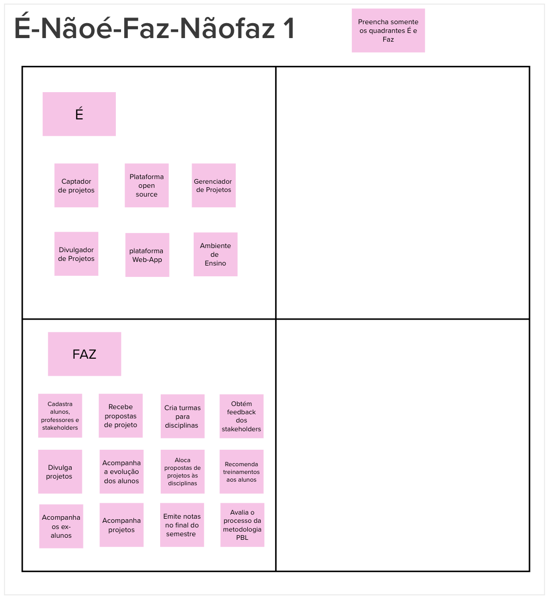

##### Não é/Não faz
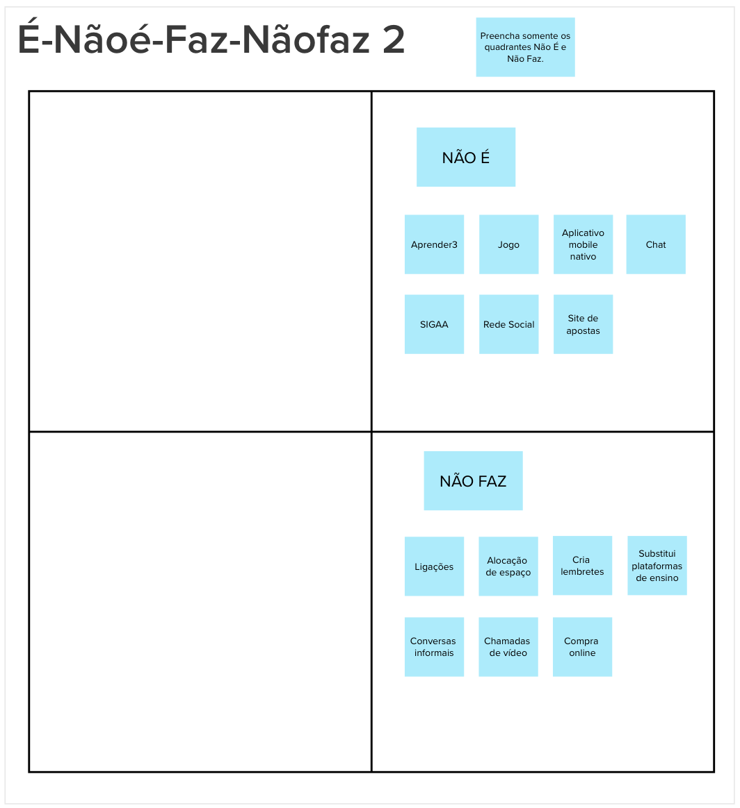

#### Esclarecimento do objetivo
Nesta etapa do Lean Inception, o resultado esperado é identificar os objetivos do negócio. Isso permite que a equipe compreenda o foco do projeto de forma clara e precisa.
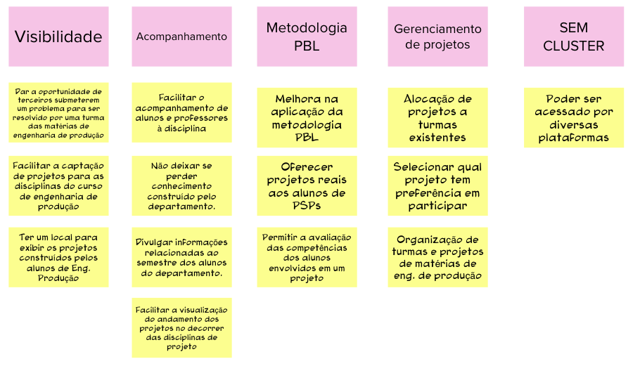

#### Personas
Durante essa atividade, o objetivo é compreender os usuários do produto e seus objetivos através da criação de personas. As personas fornecem uma representação realista dos usuários, oferecendo uma visão do produto com base em suas características e necessidades.

##### Persona 1
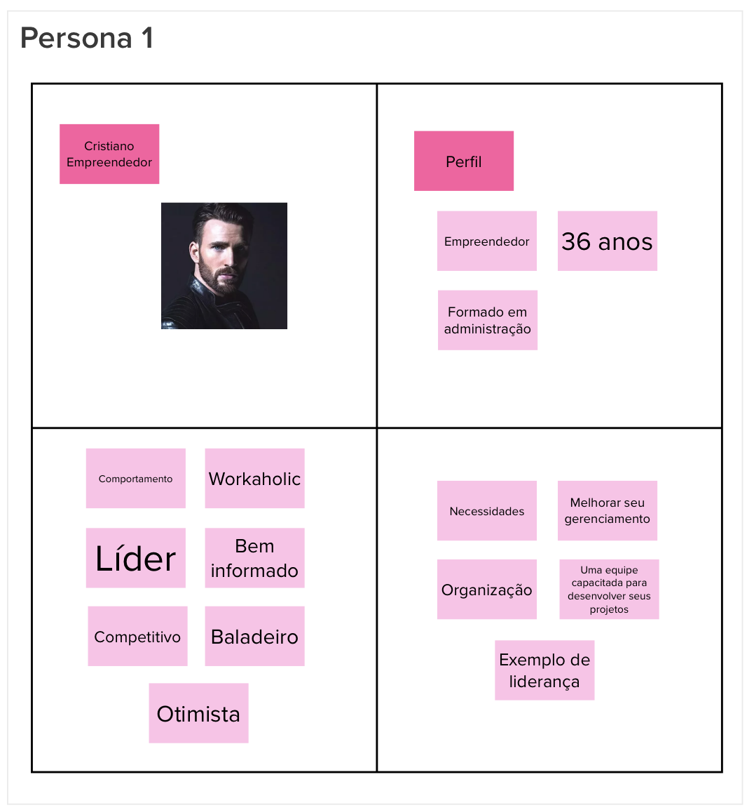
##### Persona 2
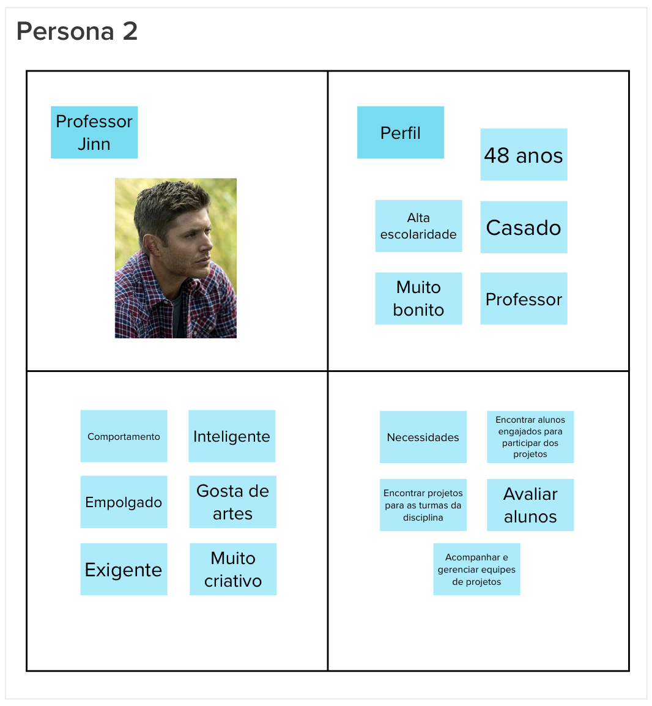
##### Persona 3
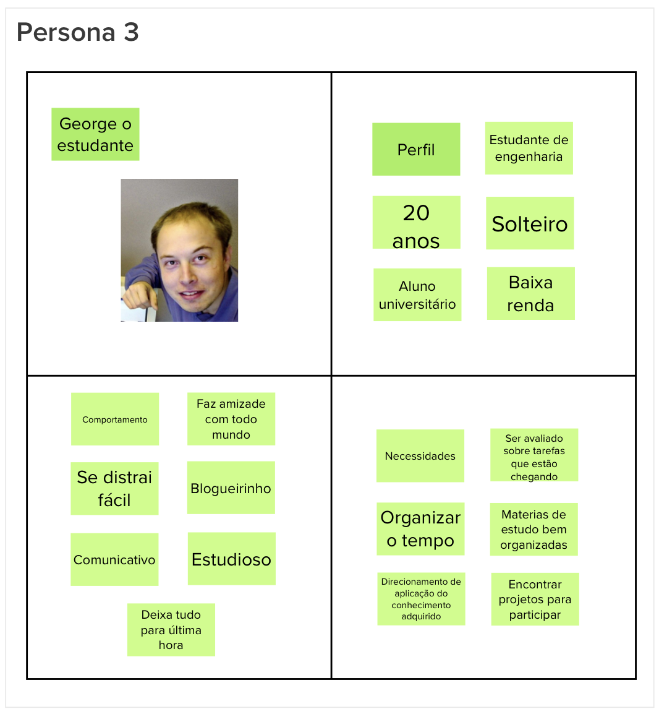

#### Jornadas do Usuário
O objetivo desta etapa é mapear a jornada de um usuário para alcançar um objetivo específico. Através da jornada, descreve-se a interação de uma persona com o produto em questão. Durante essa atividade, diversas jornadas podem ser identificadas e priorizadas, definindo o que estará presente no MVP (Minimum Viable Product). Isso ajuda a estabelecer as funcionalidades e recursos mais relevantes para incluir na versão inicial do produto.

Esta atividade foi elaborada nos semestres anteriores pelos alunos do curso de Design que fazem parte do time PUMA.
<iframe style="border: 1px solid rgba(0, 0, 0, 0.1);" width="800" height="450" src="https://www.figma.com/embed?embed_host=share&url=https%3A%2F%2Fwww.figma.com%2Ffile%2FUoMrW48HXi95MsQusizjuz%2FJornada-base-de-usu%25C3%25A1rios---PUMA-(Copy)%3Fnode-id%3D0%253A1%26t%3Da99Aye13ltRIcDsH-1" allowfullscreen></iframe>

#### Brainstorming de Funcionalidades
As funcionalidades que o produto precisa ter para atender as necessidades dos usuários são listadas a partir dos [objetivos](#esclarecimento-do-objetivo) e [personas](#personas) definidas.
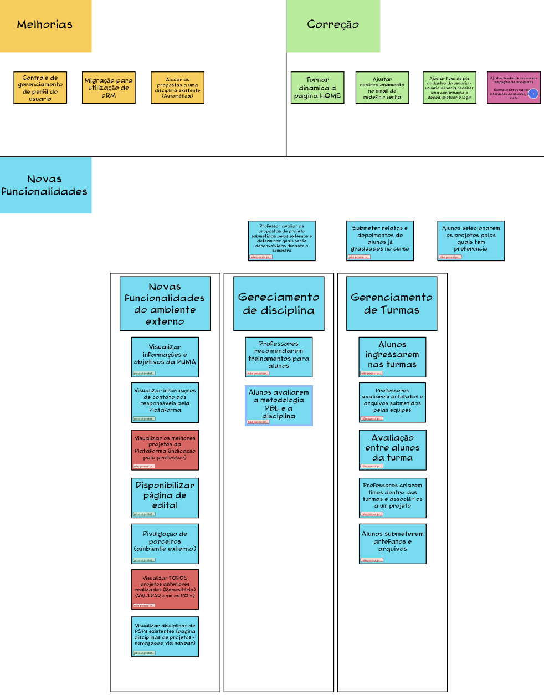

#### Revisão Técnica, de Negócio e de UX
A equipe realizou uma avaliação levando em conta o esforço, o valor e a experiência de usuário de cada uma delas tendo como insumo o conjunto de funcionalidades levantados através do [brainstorming](#brainstorming-de-funcionalidades). Dessa forma, essa avaliação tem como objetivo normalizar o que foi levantado e descartar o que não está coerente com o projeto.
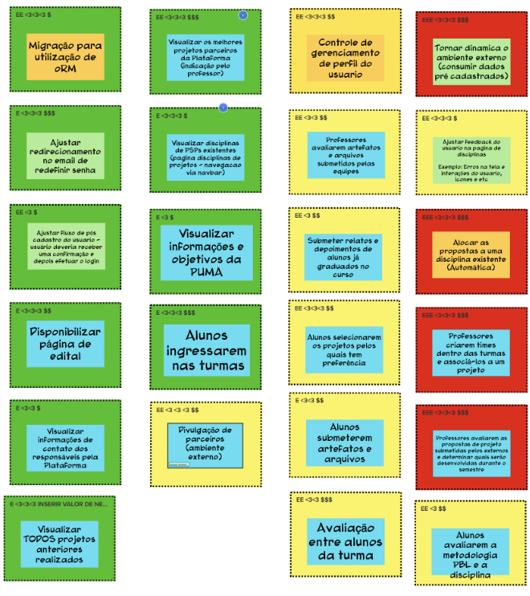

#### Sequenciador
Essa etapa tem como objetivo priorizar a implementação das funcionalidades propostas. Com base nas [personas](#personas) e nas [jornadas de usuário](#jornadas-do-usuario) mais relevantes, é possível determinar quais funcionalidades devem ser implementadas com maior rapidez. Essa decisão é tomada levando em consideração os parâmetros estabelecidos na [etapa anterior](#revisao-tecnica-de-negocio-e-de-ux), garantindo que as funcionalidades mais importantes sejam desenvolvidas inicialmente.
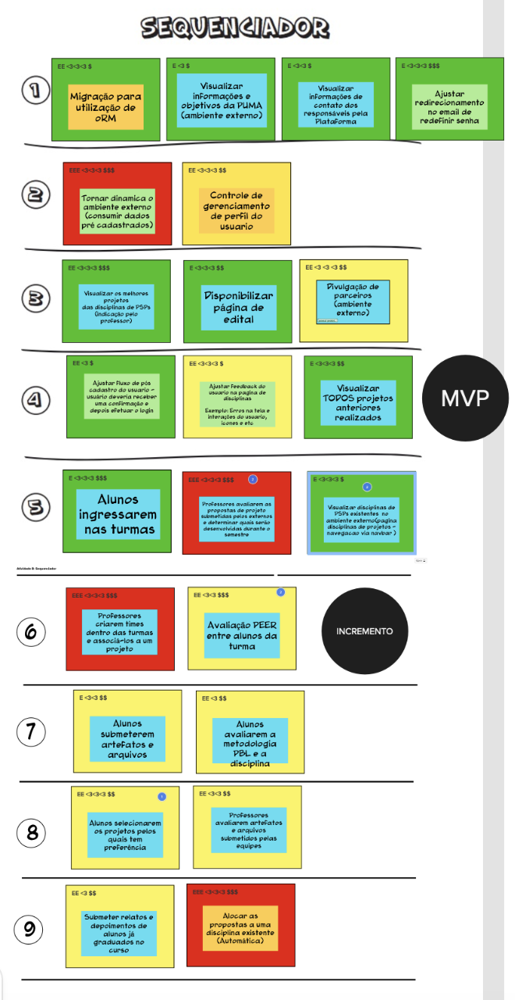

#### MVP Canvas
Esta etapa tem como objetivo detalhar o MVP e suas funcionalidades. Os blocos essenciais pra este produto são agrupados num superbloco, sendo estes:  

1. Proposta do MVP
* Personas segmentadas
* Jornadas
* Funcionalidades
* Resultado esperado
* Métricas para validar as hipóteses de negócio
* Custo & Cronograma

Esta atividade sintetiza tudo aquilo que foi produzido anteriormente durante a Lean Inception. Dessa forma, é possivel visualizar a proposta do MVP, que deve validar uma necessidade que abrange as personas e a hipótese levantada para o negócio.

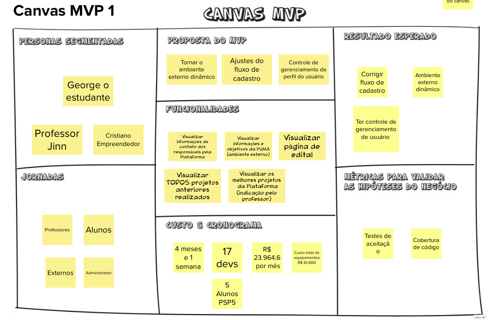

## Referências Bibliográficas
CAROLI, P. **Lean Inception: como alinhar pessoas e construir o produto certo**. 1a. ed. São Paulo: Editora Caroli, 2018.

ZANETTE, F. **MVP: como usar esse conceito para validar uma ideia e crescer com o feedback do mercado.** Disponível em: <https://resultadosdigitais.com.br/marketing/mvp-minimo-produto-viavel/>.

Ries, E. (2011). **The Lean Startup: How Today's Entrepreneurs Use Continuous Innovation to Create Radically Successful Businesses. Crown Business.**

Kniberg, H., & Skarin, M. (2017). **Agile Product Ownership: Collaborating with Stakeholders. C4Media.**

## Histórico de Revisão
| Data       | Versão | Modificação | Autor |
| :--------- | :----- | :---------- | :---- |
| 02/06/2023 | 0.1    | Criação, estruturação do documento e adição do conteúdo | Guilherme Daniel Fernandes da Silva |

