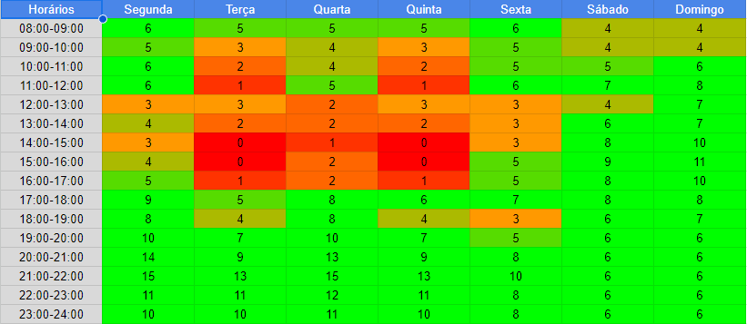

# Plano de Comunicação

## Introdução

Este documento tem como objetivo explanar como será feita a comunicação entre os membros do Projeto PUMA durante o semestre 2023-1, para garantir que todos trabalhem juntos em todas as etapas, desde os requisitos até o código, de forma a possibilitar a elaboração da melhor solução para o problema.

## Reuniões

Ao longo do semestre, o grupo terá diversas reuniões para desenvolver o projeto.

Reuniões Fixas:

* Reuniões com o cliente: segunda feira às 21h;
* Reuniões EPS: segunda feira às 20h;
* Reuniões EPS-MDS : a definir;

Conforme necessário, os membros de EPS e MDS podem agendar outras reuniões além destas para dar continuação ao desenvolvimento do projeto.

## Ferramentas

Para facilitar a comunicação entre os membros, as seguintes ferramentas serão utilizadas:

|        | Ferramenta | Descrição |
| ------ | ---------- | --------- |
| | **Discord**    | Comunicação rápida com o cliente e reuniões do time EPS-MDS |
|  | **Telegram**   | Comunicação rápida entre o time EPS-MDS|
|  | **Microsoft Teams**      | Reuniões com o cliente |
|  | **GitHub**    | Repositórios para documentos e código |

## Disponibilidade da Equipe

### Quadro de Disponibilidade

<figcaption>
Figura 1 - Quadro de Disponibilidade dos membros
</figcaption>

## Histórico de Revisão

| Data       | Versão |      Modificação      |    Autor     |
| :--------- | :----- | :-------------------- | :----------- |
| 05/05/2023 | 0.1    | Abertura do documento.| Abner Filipe |