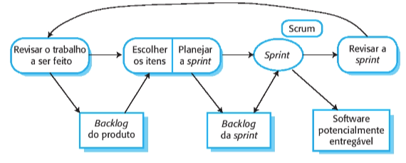

# Metodologia

## 1. Introdução

Este documento tem como objetivo explanar os métodos utilizados pela equipe durante o desenvolvimento do projeto e documentar informações e decisões relevantes à metodologia ao longo de seu desenvolvimento.

## 2. Métodos ágeis

Os métodos ágeis são projetados para produzir software útil rapidamente. Eles são baseados no desenvolvimento incremental. Os incrementos são pequenos e uma nova versão do sistema geralmente é criada e fornecida aos clientes a cada duas ou três semanas, para que seja possível obter um feedback rapidamente sobre as mudanças nos requisitos. Além disso, esses métodos minimizam a documentação usando comunicação informal no lugar de reuniões formais com documentos escritos.

Os métodos ágeis consideram o design e a implementação como atividades centrais no processo de software. Eles incorporam outras tarefas a essas atividades, como a elicitação dos requisitos e os testes. Apesar de existirem diversos processos ágeis, todos compartilham um conjunto de princípios com base no manifesto ágil e foi descrito por Sommerville, Ian (2019, p. 61):

|        Princípio        |                                                                                                              Descrição                                                                                                               |
| :---------------------: | :----------------------------------------------------------------------------------------------------------------------------------------------------------------------------------------------------------------------------------: |
| Envolvimento do Cliente |                               Os clientes devem ser envolvidos em todo o processo de desenvolvimento. Seu papel é fornecer e priorizar novos requisitos de sistema e avaliar as iterações do sistema.                                |
|   Acolher as mudanças   |                                                       Tenha em mente que os requisitos do sistema mudam e, portanto, deve-se projetar o sistema para acomodar essas mudanças.                                                        |
|   Entrega incremental   |                                                              O software é desenvolvido em incrementos e o cliente especifica os requisitos incluídos em cada um deles.                                                               |
|  Manter a simplicidade  |             Deve-se ter como foco a simplicidade, tanto do software que está sendo desenvolvido quanto do processo de desenvolvimento. Sempre que possível, trabalhe ativamente para eliminar a complexidade do sistema.             |
| Pessoas, não processos  | As habilidades do time de desenvolvimento devem ser reconhecidas e aproveitadas da melhor maneira possível. Seus membros devem ter liberdade para desenvolver seu modo próprio de trabalhar sem se prender a processos determinados. |

## 3. Extreme Programming (XP)

Extreme Programming, mais conhecido como XP, é uma metodologia ágil de desenvolvimento de software que tem como objetivo produzir software de alta qualidade e, também, melhor qualidade de vida para a equipe de desenvolvimento. A metodologia XP capacita seus desenvolvedores a lidarem com confiança às mudanças nos requisitos do cliente, mesmo no final do ciclo de vida. Além disso, Don Wells (1999) diz que a XP é configurada para pequenos grupos de programadores. A equipe XP inclui não apenas os desenvolvedores, mas também os gerentes e clientes, todos trabalhando juntos.

Os requisitos se baseiam em histórias simples dos clientes (histórias de usuário) e são utilizados como base para decidir qual funcionalidade deve ser incluída em um determinado incremento. Os programadores trabalham em pares (pair programming) e desenvolvem testes para cada tarefa antes de escreverem o código. Todos os testes devem ser executados com sucesso quando o novo código é integrado ao sistema, já que há um curto intervalo de tempo entre as releases do sistema.

<figcaption>Imagem 1: Metodologia XP.</figcaption>

No decorrer do projeto, o time utilizará algumas práticas do Extreme Programming (XP). Duas dessas práticas serão a Programação em Pares e a utilização de Histórias de Usuário.

Além disso, também adotaremos os valores de Feedback e [Comunicação](https://fga-eps-mds.github.io/2023-1-PUMA-Doc/projeto/comunicacao/).

Através do princípio da Comunicação, todos os membros da equipe serão considerados parte integrante do time e deverão manter uma comunicação frequente. Trabalharemos juntos em todas as etapas do projeto, desde a definição dos requisitos até a codificação, buscando encontrar a melhor solução para o problema. O Feedback contínuo será valorizado, permitindo que a equipe mantenha o foco e o desenvolvimento siga na direção correta.

Durante o desenvolvimento do projeto, adaptaremos as práticas e valores do Extreme Programming conforme as necessidades identificadas.

## 4. Scrum
Scrum é um método ágil, iterativo e incremental para gerenciamento de projetos, que não necessariamente precisam ser projetos de desenvolvimento de software. Dentre os métodos ágeis, Scrum é o mais conhecido e usado. Por meio da organização das tarefas e prioridades que o Scrum estabelece, passa a ser possível garantir o cumprimento de prazos e um maior foco nas diretrizes estabelecidas pelo planejamento. Sabendo quais são as atividades que possuem mais importância, as equipes consegue organizar melhor o fluxo de uma para a outra.

O Scrum utiliza o product backlog que é um registro que contém as áreas do produto que devem ser desenvolvidas. De acordo com a prioridade de cada produto, cria-se uma lista de tarefas de liberação a partir da lista de tarefas de produtos, que é o ponto de conexão para que as necessidades da lista de tarefas de produtos sejam processadas. Publicar uma tarefa é um ponto na criação de uma tarefa do sprint e representa o período de tempo para a conclusão de uma tarefa (chamada de história de usuário).

<figcaption>Imagem 2: Fluxo de trabalho da metodologia scrum.</figcaption>

### 4.1 Sprint
A sprint é a unidade fundamental de desenvolvimento Scrum. Ela consiste em um período de tempo fixo e curto, no qual um incremento do produto é entregue. Após a conclusão de uma sprint, a próxima deve começar imediatamente.

Durante uma sprint, nenhuma alteração deve ser feita que comprometa as metas estabelecidas. A qualidade do produto não deve ser prejudicada, e o backlog do produto pode ser refinado conforme necessário. Além disso, o escopo pode ser esclarecido e renegociado à medida que a equipe aprende mais ao longo da sprint.

Dentro de uma sprint, a equipe realizá eventos importantes, como o Sprint Planning, o Daily Scrum e o Sprint Review.

O Sprint Planning é o evento que inicia e estabelece o trabalho a ser realizado durante a sprint. A equipe Scrum colaborativamente cria um plano de trabalho para a sprint.

O Daily Scrum tem como objetivo inspecionar o progresso da sprint e adaptar o backlog da sprint conforme necessário. É uma reunião diária em que a equipe discute o trabalho realizado, os desafios encontrados e planeja as próximas atividades.

O Sprint Review é o evento em que a equipe inspeciona os resultados da sprint e determina adaptações futuras. Nesse evento, o Scrum Team apresenta o trabalho concluído aos stakeholders e discute o progresso em relação à meta do produto.

Ao longo do desenvolvimento do projeto, a equipe adotará os conceitos e componentes do Scrum de acordo com as necessidades identificadas, buscando aproveitar os benefícios desse metodologia ágil.

## 5. Lean Inception

A Lean Inception, desenvolvida por Paulo Caroli, é uma técnica utilizada para alinhar a equipe em relação à construção de um MVP (Minimum Viable Product - Produto Mínimo Viável). Essa técnica envolve a realização de um workshop composto por 9 etapas que facilitam o entendimento das necessidades de um produto bem-sucedido.

No contexto deste projeto, a Lean Inception foi aplicada com o objetivo de alinhar rapidamente os membros da equipe em relação ao produto em desenvolvimento.

A aplicação detalhada da *Lean Inception* encontra-se no [Documento de Visão do Produto](https://fga-eps-mds.github.io/2023-1-PUMA-Doc/projeto/doc-visao/).

## 6. Referência

> - Sommerville, Ian. **Engenharia de software**. 10. ed. São Paulo: Pearson Addison Wesley, 2019.
> - Foggetti, Cristiano. **Gestão ágil de projetos**. São Paulo: Education do Brasil, 2014.
> - Wells, Don. Extreme Programming: A gentle introduction. **Extreme Programming**, 1999. Disponível em: http://www.extremeprogramming.org/
> - Metodologias ágeis: o que é Pair Programming?. **Programadores Brasil**, 2020. Disponível em: https://programadoresbrasil.com.br/2020/04/o-que-e-pair-programming/
> - Metodologia Ágil: O que é Kanban. **Programadores Brasil**, 2020. Disponível em: https://programadoresbrasil.com.br/2020/02/metodologia-agil-o-que-e-kanban/
> - Extreme Programming. **Agile Alliance**. Disponível em: https://www.agilealliance.org/glossary/xp/#.YRnn2znQQyc
> - Metodologia Ágil: O que é Scrum. **Programadores Brasil**, 2020. Disponível em: https://programadoresbrasil.com.br/2020/02/o-que-e-scrum-metodologia-agil/
> - Ken, SCHWABER; SUTHERLAND, Jeff. The Scrum Guide. **Scrum Guides**. Disponível em: [ttps://scrumguides.org/docs/scrumguide/v2020/2020-Scrum-Guide-US.pdf#zoom=100](https://scrumguides.org/docs/scrumguide/v2020/2020-Scrum-Guide-US.pdf#zoom=100). Acesso em: 10 dez. 2022.
> - The Rules of Extreme Programming. **Extreme Programming**. Disponível em: [http://www.extremeprogramming.org/rules.html](http://www.extremeprogramming.org/rules.html).

## 7. Histórico de Revisão

| Data       | Versão | Modificação                     | Autor         |
| :--------- | :----- | :------------------------------ | :-----------  |
| 27/05/2023 | 0.1    | Abertura do documento.          | Juliana Valle |